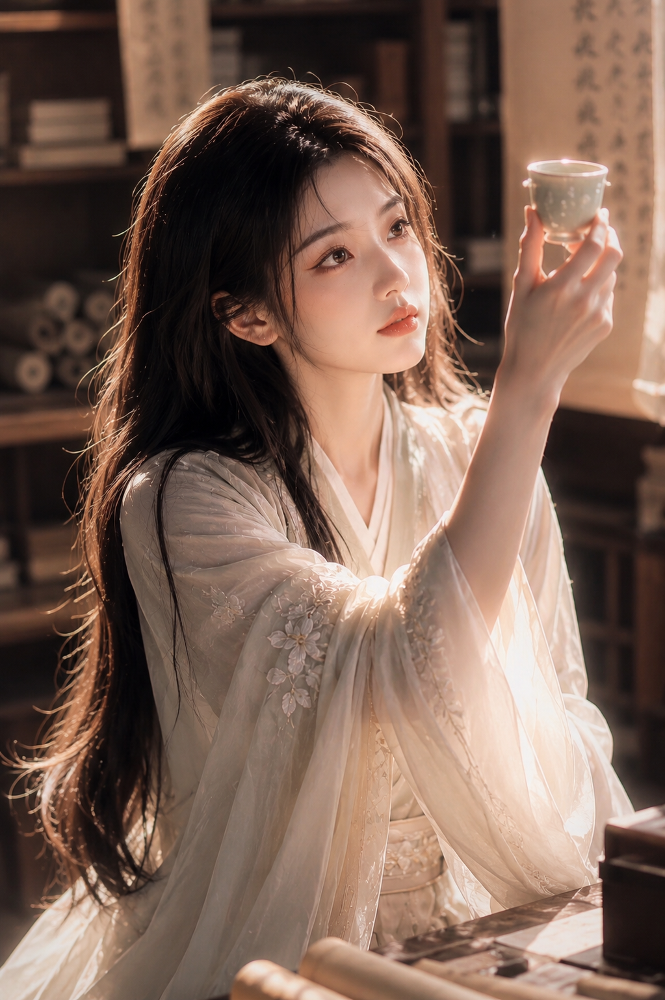

# 古风书房品茶

> 风格核心：高级东方电影感 × 护肤品广告肌肤 × 暖金侧逆光。场景自由替换。

## 固定风格核心

```
人物类型：年轻东方女性，全新面孔，脸型精致流畅，骨相清晰，不幼态，非网红模板脸
肌肤标准：清透细腻水润，柔和半透明质感，温润象牙白，轻微自然血色，
          平滑但不塑料，保留极细微真实肌理，无粗大毛孔/痘坑/橘皮/油光
          接近高级护肤品广告中的东方女性肌肤质感
光线风格：单一自然侧逆光，暖金色调，光线穿过衣料/物体边缘形成柔和明暗层次，
          空气中有极细微浮尘
镜头参数：85mm 人像镜头，f/1.4，背景奶油化虚化，脸部/眼睛/嘴唇细节清晰
画面质感：高级东方电影截图 + 护肤品广告质感，低饱和，柔和高光，暗部有层次，
          轻微胶片颗粒，不过度锐化，不油画不插画不3D渲染
配色基调：奶白、暖金、茶棕、浅木色
品牌标识（可选）：人物左侧袖口织绣布标（替换为你的品牌名），低对比度，像服装自带工坊标
禁止元素：手机界面/社交媒体/字幕/英文/点赞/进度条/边框/水印/现代UI
```

## 可变参数

| 参数 | 默认值 | 可替换为 |
|------|--------|---------|
| 场景 | 古代书房（深色木书架/卷轴/笔架/书法挂轴） | 古风庭院、竹林凉亭、旧茶室、宫殿回廊 |
| 服装 | 奶白古装长裙（纱质/交领/宽袖/浅花暗纹） | 颜色/材质/朝代风格可换，保持克制高级 |
| 发型 | 自然披散黑长发，轻微凌乱，发尾被光照亮 | 发型可换，不盘发不束发不短发 |
| 动作 | 坐姿，单手托白瓷茶杯，眼看杯中光 | 看书/写字/抚琴/赏花，保持人物与物件互动 |
| 构图 | 3:4竖版，中近景，人物偏左，物偏右对角 | 构图可调 |
| 光线色调 | 金色夕阳侧逆光 | 晨光/午后柔光/月光，保持单一自然光源 |

## 负面约束固定

```
盘发，高髻，发髻，束发，短发，双马尾，夸张发饰，二次元，动漫脸，幼态网红脸，
模板脸，粗大毛孔，痘坑，坑洼皮肤，橘皮纹，粗糙皮肤，油腻反光，过度磨皮，
死白皮肤，眼神呆滞，空洞眼神，僵硬表情，夸张媚态，摆拍感，手指错误，多余手指，
均匀棚拍光，多光源，仙侠特效，发光法术，现代服装，现代房间，手机界面，字幕，
英文文字，多处品牌名，大面积水印，油画感，插画感，3D渲染感，过度锐化
```

## 使用方式

```
固定风格核心 + 场景=X + 服装=Y + 动作=Z → 生成完整 prompt
```

## 参考图



---

<!-- tracking
{"status":"tested","rating":"★★★★★","last_used":"2026-07-15","total_uses":1,"trace":[{"date":"2026-07-15","usage":"用户提供完整 prompt+参考图，抽离为风格核心+可变参数结构","result":"✅ 已脱水入库"}]}
-->
