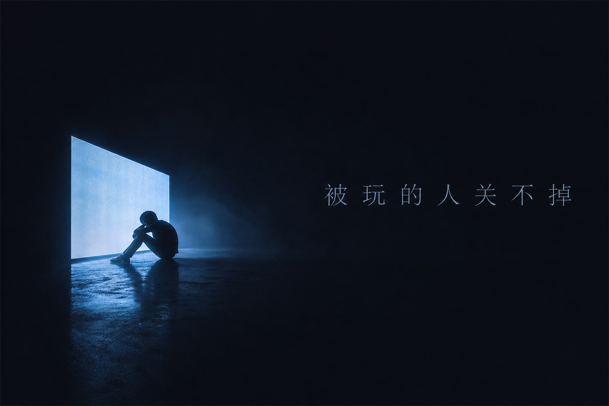

# 公众号封面

> 暗色高级感 · 金句即封面 · 文字集成排版 · 博物馆级留白

## 固定风格核心

- **肌肤/质感标准**：无人物，纯意境。photorealistic, fine art photograph
- **光线风格**：单束冷蓝或暖金光线穿透暗空，cinematic lighting, atmospheric haze
- **镜头参数**：35mm film grain, museum quality
- **画面质感**：大量负空间（negative space），wabi-sabi 留白美学
- **配色基调**：深蓝黑底（#0F172A系），光点用冷蓝（#4CC9F0）或暖金（#c0a060）
- **禁止元素**：动漫、卡通、插画、赛博朋克、直白物体罗列、科技芯片、机器人

## 可变参数

| 参数 | 默认值 | 可替换为 |
|------|--------|---------|
| 光影色温 | 冷蓝（冷静文） | 暖金（走心文） |
| 文字 | 金句 7-14 字 | 任何文章核心金句 |
| 意象 | 暗室虚空 | 门缝光线、孤立人影、屏幕荧光 |

## 负面约束固定

```
NO anime, cartoon, illustration, cyberpunk, tech chips, robots
NO cluttered objects, stock photo style
NO text overlay post-processing (imagemagick)
```

## 使用方式

```
固定风格核心 + 光影色温=[冷蓝/暖金] + 文字=[金句7-14字] + 意象=[虚空/光门/人影]
→ 生成完整 prompt
```

**完整 prompt 模板**：
```
Fine art photograph, dark void with [光影描述], [核心意象],
Chinese text [金句] as elegant typography integrated into composition,
photorealistic, minimalist, museum quality, negative space, cinematic
```

**金句选取规则**：文章最锋利的一句，7-14 字，有独立传播力。看完封面就想点开。

## 出图管线

Studio 中台 → token4ai-upstream-1 → gpt-image-2 → R2 CDN

## 参考图



<!-- tracking
{"status":"tested","rating":"★★★★☆","last_used":"2026-07-21","total_uses":1,"trace":[{"date":"2026-07-21","usage":"公众号《会用AI了，然后呢？》封面-被玩的人关不掉","result":"✅ 暗室蓝光+金句排版一体，海报感强"}]}
-->
