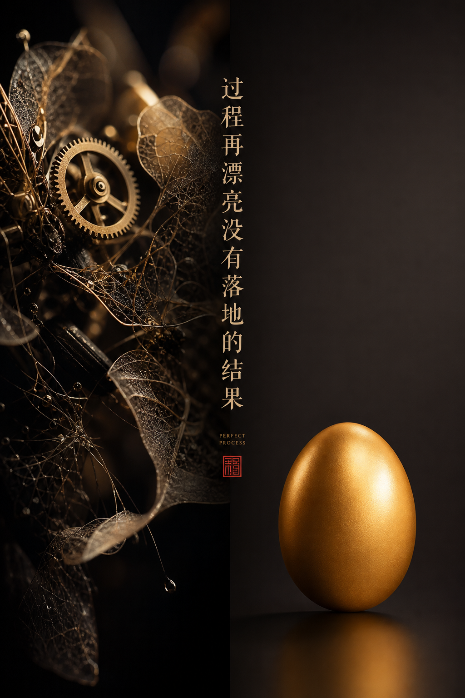

# 公众号文内配图

> 意境插图 · 金句集成 · 段落断点 · 暗色高级感

## 固定风格核心

- **肌肤/质感标准**：无人物，纯意境。photorealistic, fine art photograph
- **光线风格**：单束光线穿破暗空，cinematic lighting, atmospheric haze
- **镜头参数**：35mm film grain, museum quality
- **画面质感**：大量负空间（negative space），wabi-sabi 留白美学
- **配色基调**：深蓝黑底（#0F172A系），光点用冷蓝（#4CC9F0）或暖金（#c0a060）
- **禁止元素**：动漫、卡通、插画、直白物体罗列、素材库存照风

## 可变参数

| 参数 | 默认值 | 可替换为 |
|------|--------|---------|
| 段落情绪 | 疑问/反思 | 希望、决心、警示 |
| 文字 | 段落金句 7-14 字 | 任何段落核心句 |
| 意象 | 抽象光影 | 具体隐喻（门/路/光） |
| 数量 | 2-3 张 | 按文章长度弹性调整 |

## 负面约束固定

```
NO anime, cartoon, illustration, stock photo style
NO cluttered objects
NO text overlay post-processing
MUST match cover style (dark void + single light beam)
```

## 放置规则

| 位置 | 图 | 金句类型 |
|------|-----|---------|
| 开篇 | 图1 | 核心冲突/钩子 |
| 中段 | 图2 | 方法论/判断 |
| 结尾 | 图3 | 升华/行动指引 |

- 连续纯文字 ≤ 3 段后必须有视觉断点
- 每张图金句不重复，与封面金句不重复

## 使用方式

```
固定风格核心 + 段落情绪=[疑问/希望/警示] + 文字=[段落金句] + 意象=[光/门/影]
→ 生成完整 prompt
```

**完整 prompt 模板**：
```
Fine art photograph, [段落意象描述], [光影氛围],
Chinese text [段落金句] as elegant typography integrated into composition,
photorealistic, minimalist, museum quality, negative space, cinematic
```

## 参考图



<!-- tracking
{"status":"tested","rating":"★★★★☆","last_used":"2026-07-21","total_uses":1,"trace":[{"date":"2026-07-21","usage":"公众号《会用AI了，然后呢？》文内配图-过程再漂亮没有落地的结果","result":"✅ 3张金句配图，风格统一，做好阅读断点"}]}
-->
